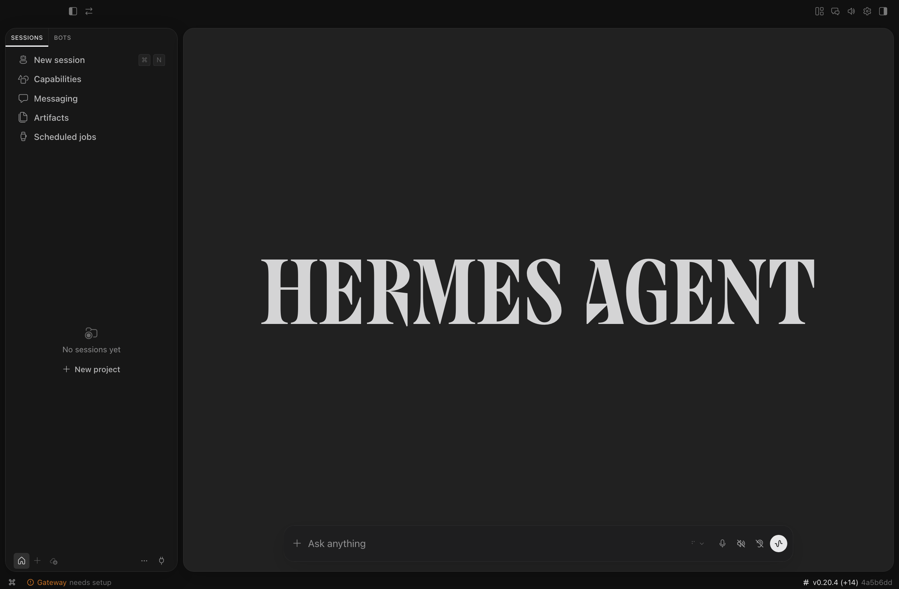

# OpenAI Shadcn — Hermes Desktop theme

A complete `@hermes/plugin-sdk` Desktop theme with a neutral light/dark palette
and an optional floating-panel treatment for the built-in layout tree.



## Demonstrates

- `THEMES_AREA` with full light and dark `DesktopTheme` palettes
- `requestTheme()` for an imperative, persisted activation
- `PALETTE_AREA` commands for activate and one-click rollback
- `ctx.storage` for user intent across plugin reloads
- Theme-gated CSS that disappears immediately when another theme is selected
- Stable `data-slot` / `data-tree-*` hooks for scoped Desktop polish

The CSS does not replace the pane tree. Sessions, profile/gateway routing,
resizing, collapsing, dragging, Files, Terminal, and Review remain core-owned.

## Install from this examples repository

```bash
mkdir -p ~/.hermes/desktop-plugins
cp -R openai-shadcn-desktop ~/.hermes/desktop-plugins/openai-shadcn
```

Hermes Desktop hot-loads the folder. If needed, run **Reload desktop plugins**
from `Cmd/Ctrl+K`.

The theme activates on first load. Palette commands:

- **Theme: activate OpenAI Shadcn**
- **Theme: return to Hermes default**

## Standalone distribution

The independently versioned package, release ZIPs, and update instructions live
at https://github.com/agentik-os/hermes-openai-shadcn.

## Notes

The plugin is intentionally production-shaped rather than a minimal one-method
snippet: the full palette and the floating layout are the behavior being shown.
All custom layout rules are gated by
`data-hermes-theme="openai-shadcn"`, so rollback is immediate and complete.

## License

MIT
